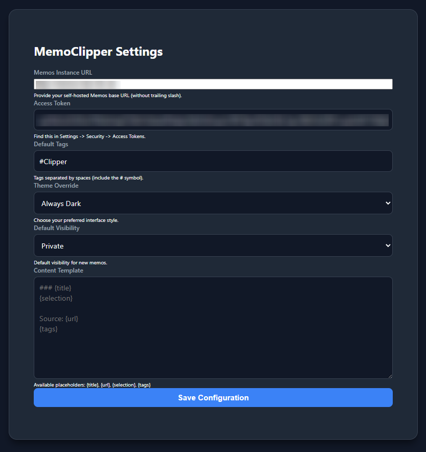
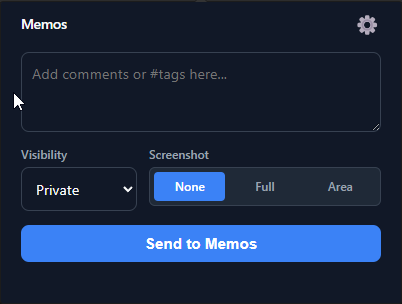

# MemoClipper

A clean, efficient browser extension to clip web pages, selections, and thoughts directly to your self-hosted [Memos](https://usememos.com/) instance.

Designed to work seamlessly with the latest versions of Memos.

## Features

*   **Quick Clipping**: Save current page details or selected text instantly.
*   **Screenshots**: Attach full-page or partial-area screenshots to your memos. 
*   **Custom Templates**: Define exactly how you want your notes to look with a flexible template system.
*   **Privacy Control**: Set default visibility (Public, Protected, Private) or change it on the fly.
*   **Theme Aware**: Follows your system theme or lets you force Light/Dark mode.

## Installation

1.  Clone or download this repository.
2.  Open Chrome/Edge and navigate to `chrome://extensions`.
3.  Enable **Developer mode** (top right toggle).
4.  Click **Load unpacked** and select the folder containing this extension.

Alternative: 

1. Download just the .crx file in this repository.
2. Open Chrome/Edge and navigate to `chrome://extensions`.
3. Enable **Developer mode** (top right toggle).
4. Drag and drop the .crx file into the extensions page.

## Configuration

Before you start clipping, you need to connect the extension to your Memos server.

1.  Right-click the extension icon and select **Options**, or click the gear icon ⚙️ in the popup.
2.  **Memos URL**: Enter your instance URL (e.g., `https://memos.example.com`).
3.  **Access Token**: 
    *   Go to your Memos instance.
    *   Navigate to **Settings** -> **My Account** -> **Access Tokens**.
    *   Create a token and paste it here.
4.  **Content Template**: Customize how clips are saved. You can use placeholders like `{title}`, `{url}`, `{selection}`, and `{tags}`.

## How to Use

1.  **Clip a Page**: Click the MemoClipper icon. The title and URL are automatically ready to be saved.
2.  **Clip Text**: Select text on a webpage -> Right Click -> "MemoClipper" context menu (or just open the popup to see it pre-filled if configured).
3.  **Add Screenshots**: Choose "Full" or "Area" in the popup to capture visual context.
4.  **Send**: Hit "Send to Memos" and you're done.

## Permissions

*   **Storage**: To save your server URL and preferences.
*   **ActiveTab**: To access the title and URL of the current page.
*   **Scripting**: To capture selected text and screenshots.
*   **Host Permissions**: To communicate with your self-hosted Memos API.
